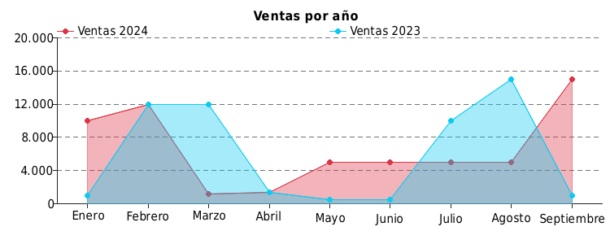
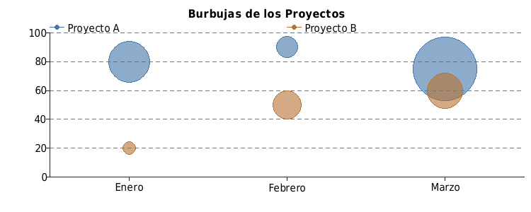
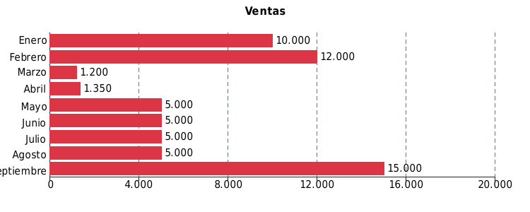
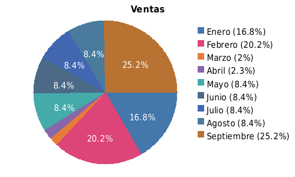
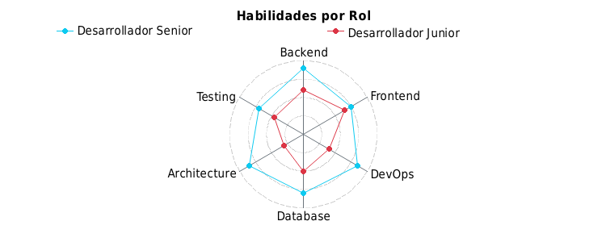
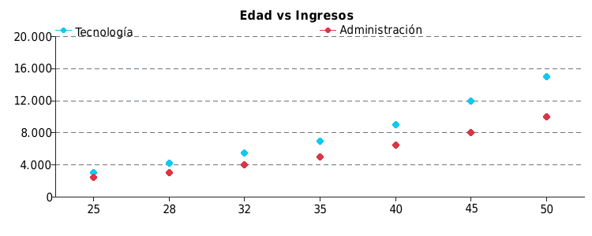
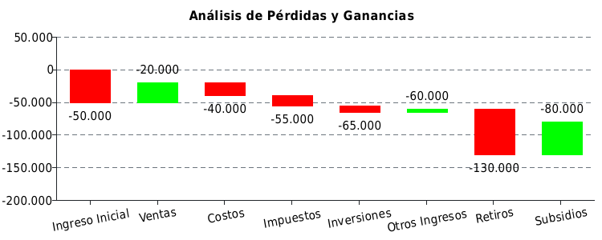

# Derafu: Chart - PHP Chart Library


Derafu Chart is a PHP library for creating diverse charts. The library is designed to generate charts entirely in PHP using GD or other renderers. It supports a variety of chart types and is easy to extend.

## Features

- 📊 Multiple chart types: Bar, Line, Pie, Radar, Waterfall, and more.
- ⚙️ Fully customizable options.
- 📦 Lightweight and easy to integrate.
- 🖼️ Output in PNG and flexible rendering options.
- 💡 Extensible via custom renderers.
- 🧩 Encodable to JSON for interoperability.
- 🏷️ Open-source under the MIT license.

## Installation

You can install the library using Composer:

```bash
composer require derafu/chart
```

## Usage

You can choose the style that best suits your coding preferences or project requirements:

- Creating a Chart with the Factory.
- Creating a Chart with Method Chaining.

Both approaches allow flexibility depending on whether you prefer array-based configuration or object-oriented method chaining.

### Creating a Chart with the Factory

Here’s how to create a simple bar chart using the `ChartFactory`:

```php
use Derafu\Chart\ChartFactory;
use Derafu\Chart\Enum\ChartType;

$chart = (new ChartFactory())->renderFromArray([
    'type' => ChartType::BAR,
    'title' => 'Ventas',
    'label_x' => 'Mes',
    'label_y' => 'Ventas',
    'datasets' => [
        [
            'points' => [
                'Enero' => 10000,
                'Febrero' => 12000,
                'Marzo' => 1200,
                'Abril' => 1350,
                'Mayo' => 5000,
                'Junio' => 5000,
                'Julio' => 5000,
                'Agosto' => 5000,
                'Septiembre' => 15000,
            ],
        ],
    ],
]);

file_put_contents('chart.png', $chart);
```

### Creating a Chart with Method Chaining

Here’s how to create the same bar chart using method chaining:

```php
use Derafu\Chart\Chart;
use Derafu\Chart\Dataset;
use Derafu\Chart\Enum\ChartType;

$chart = (new Chart(ChartType::BAR))
    ->setTitle('Ventas')
    ->setLabelX('Mes')
    ->setLabelY('Ventas')
    ->addDataset(
        (new Dataset())
            ->setLabel('2024')
            ->setColor('blue')
            ->addPoints([
                'Enero' => 10000,
                'Febrero' => 12000,
                'Marzo' => 1200,
                'Abril' => 1350,
                'Mayo' => 5000,
                'Junio' => 5000,
                'Julio' => 5000,
                'Agosto' => 5000,
                'Septiembre' => 15000,
            ])
    );

file_put_contents('chart.png', $chart->render());
```

## Chart Types

Here is an overview of the chart types supported, with examples.

### 1. Area Chart

Displays continuous data trends over time or categories. Ideal for showing volume and trends.



### 2. Bar Chart

Shows discrete data comparisons using vertical bars. Perfect for categorical comparisons.


### 3. Bubble Chart

Highlights relationships and distributions. Bubble size represents a third dimension.



### 4. Horizontal Bar Chart

Provides an alternative for displaying bar data, especially useful when labels are long.



**Text Output Example:**

```plaintext
Chart name: horizontal_bar

                                     Ventas

Enero      │ ██████████████████████████ 10.000
Febrero    │ ███████████████████████████████ 12.000
Marzo      │ ███ 1.200
Abril      │ ███ 1.350
Mayo       │ █████████████ 5.000
Junio      │ █████████████ 5.000
Julio      │ █████████████ 5.000
Agosto     │ █████████████ 5.000
Septiembre │ ██████████████████████████████████████ 15.000
           └────────────────────────────────────────────────────
           0         4K        8K        12K       16K       20K
```

### 5. Pie Chart

Represents proportions in a dataset. Great for visualizing percentages.



### 6. Radar Chart

Compares multiple variables across multiple dimensions. Ideal for skill or performance analysis.



### 7. Scatter Plot

Shows relationships between two variables using points. Commonly used for distribution analysis.



### 8. Waterfall Chart

Visualizes cumulative changes in value over a sequence. Useful for profit and loss analysis.



## Roadmap

- 🔍 Export charts to JSON (e.g., Chart.js, regression libraries).
- 📈 Support trendlines and regression models.
- 🔄 Add SVG rendering support.
- 🌐 Add more internationalization options.

## Contributing

Contributions are welcome! Please feel free to submit a Pull Request. For major changes, please open an issue first to discuss what you would like to change.

## License

This package is open-sourced software licensed under the [MIT license](https://opensource.org/licenses/MIT).

---

Happy charting!
